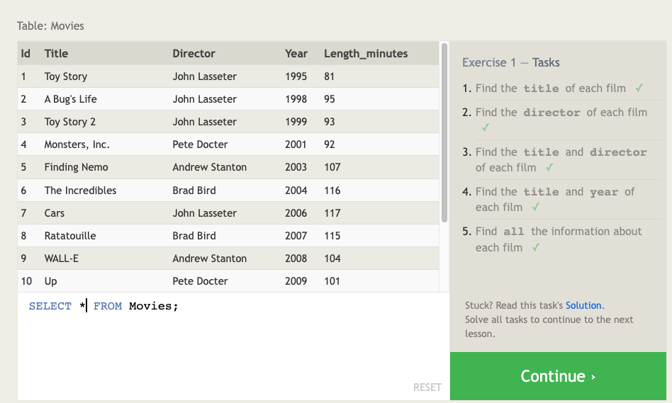
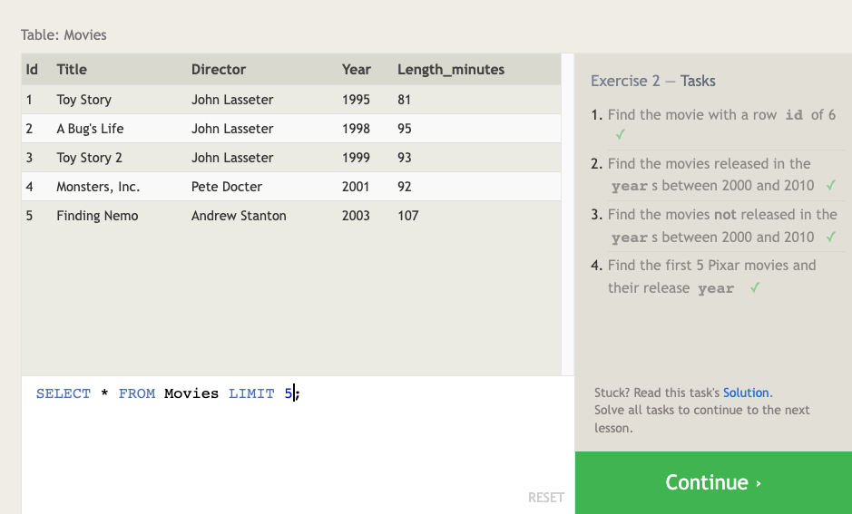
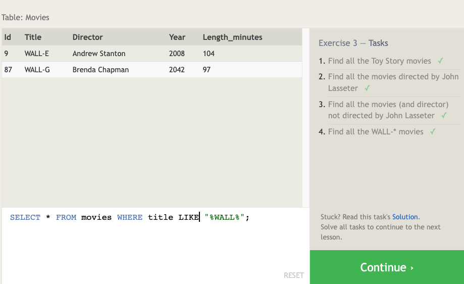
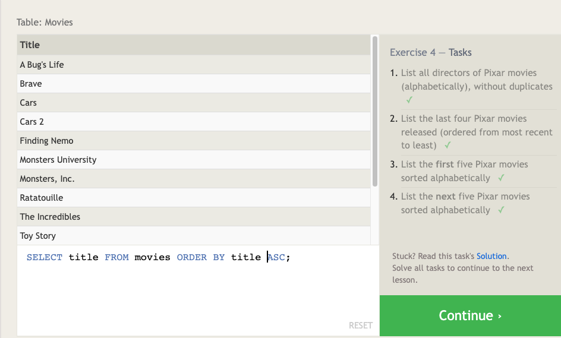
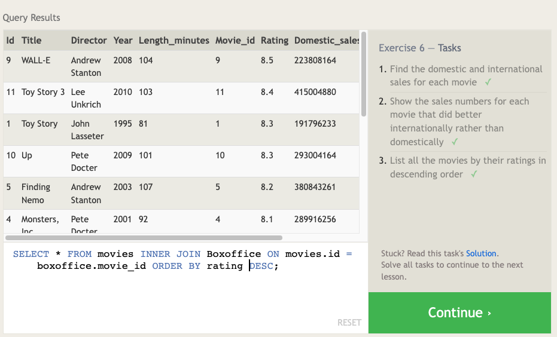
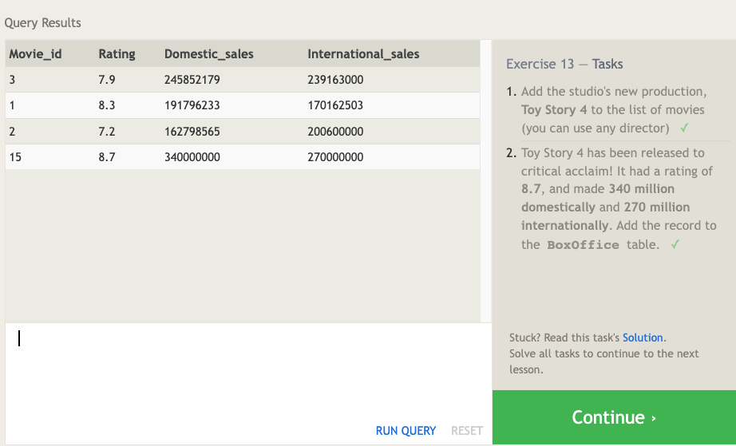
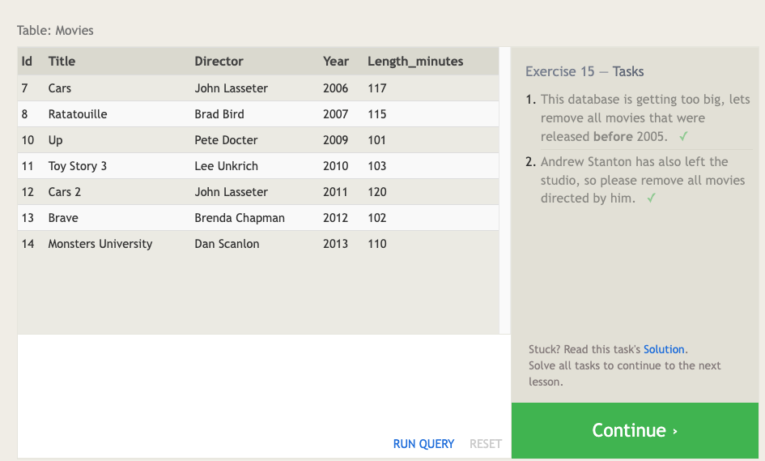
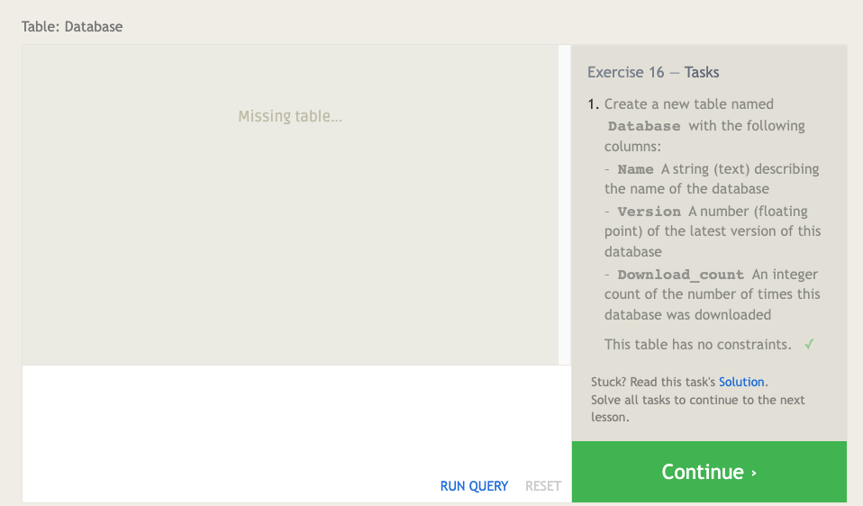
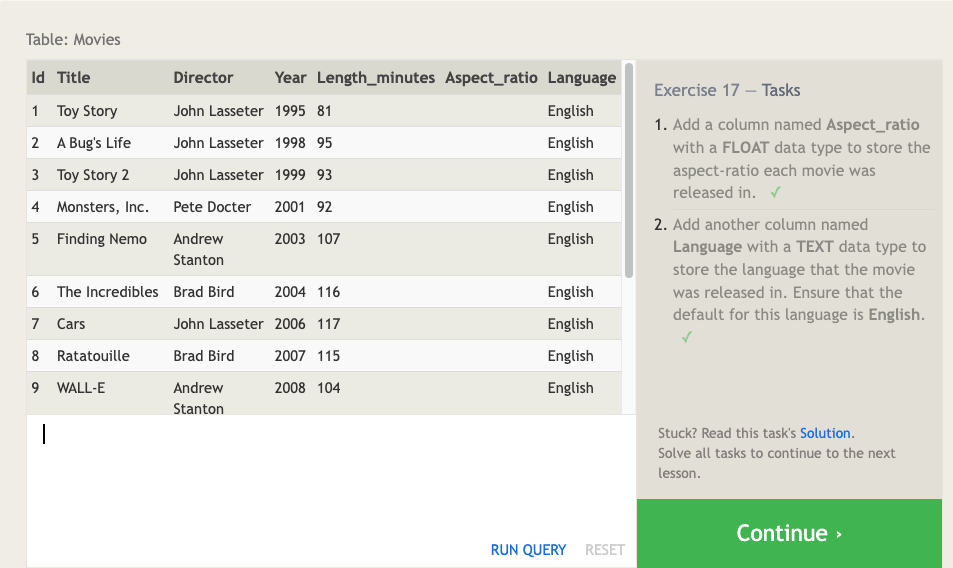
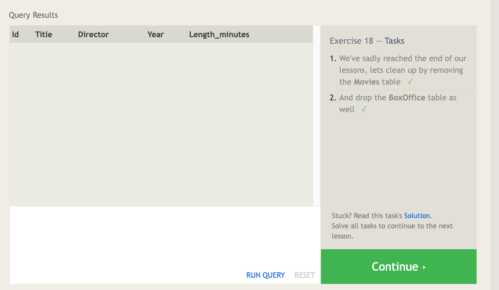

# SQL (Structured Query Language)

A language designed to allow both technical and non-technical users query, manipulate, and transform data from a relational database. And due to its simplicity, SQL databases provide safe and scalable storage for millions of websites and mobile applications. [source](https://sqlbolt.com/).

## Relational databases

Its a database of related informations that can be representaed as a two-dimentional table (columns and rows).

| Country    | Population (Most recent estimate)| President                   |
| -----------| -------------------------------- | --------------------------- |
| Algeria    | 44,700,000                       | Abdelmadjid Tebboune        |
| Brazil     | 217,240,060                      | Luiz Inácio Lula da Silva   |
| Colombia   | 52,156,254                       | Gustavo Petro               |

- [Data Source for Algeria](https://en.wikipedia.org/wiki/Algeria)
- [Data Source for Brazil](https://en.wikipedia.org/wiki/Brazil)
- [Data Source for Colombia](https://en.wikipedia.org/wiki/Colombia)

### Database normalization

is the process of structuring a relational database in accordance with a series of so-called normal forms in order to reduce data redundancy and improve data integrity. It is useful because it minimizes duplicate data in any single table, and allows for data in the database to grow independently of each other.

### SQL Exercise Screeshots

